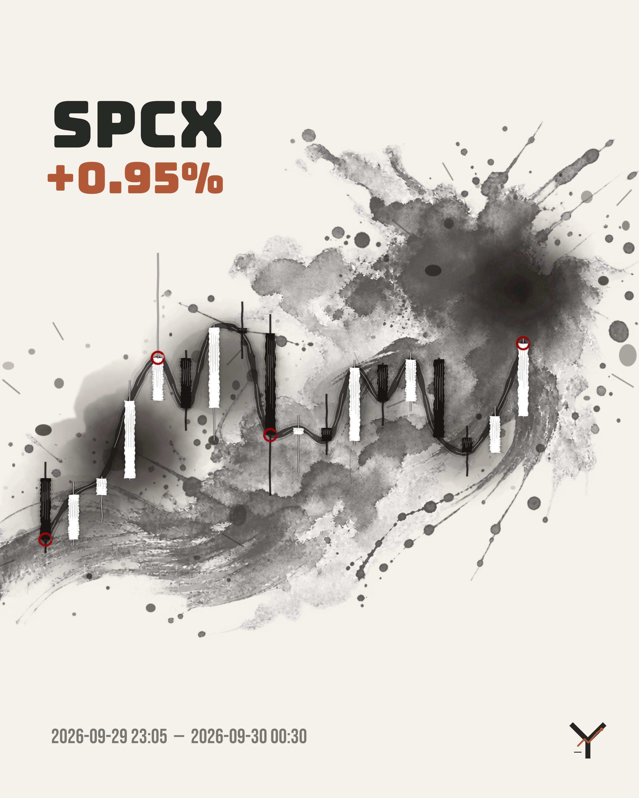
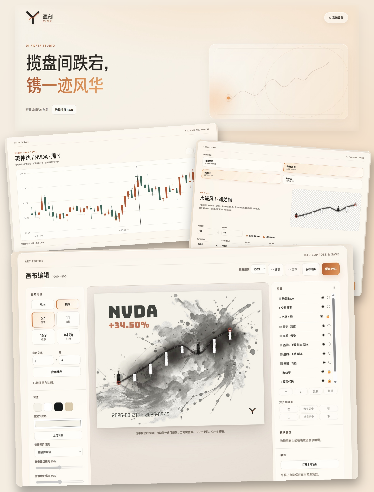
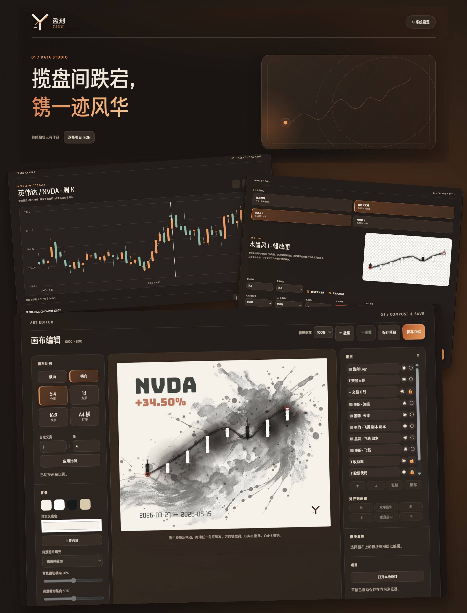

# YINK · 盈刻

**[简体中文](README.md) · English**

**Preserve the movement. Make it yours.**

A stretch of market history. A moment you chose. A piece you can keep.

YINK is an open-source editor for turning stock price charts and trade markers into art posters. Start with a real price trace, choose candlesticks or expressive ink strokes, then compose your own image with type, textures, and layers. The creative workflow runs in your browser.

**[Try the live app → https://leekquant.tech/](https://leekquant.tech/)**

No signup or installation required. You can also download the offline edition and create locally with CSV data.

[User guide (Chinese)](docs/USER_GUIDE.md) · [Contribute](CONTRIBUTING.md) · [Acknowledgements](ACKNOWLEDGEMENTS.md) · [Third-party notices](THIRD_PARTY_NOTICES.md)

## From price history to a finished piece

<p align="center"></p>

Keep the price movement, choose the visual expression. Add your trades, or create a poster from price history alone.

<details>
<summary>See the artwork in a room</summary>

<p align="center"></p>

The room image illustrates a possible artwork presentation. The interface images below are compositions made from real website screenshots.

</details>

## The real workspace

The screenshots show the light and dark themes. Symbols and returns in example artwork demonstrate the software; they are not performance claims.

| Light theme | Dark theme |
| --- | --- |
|  |  |

## Create in five steps

**Choose a stock and time range → Add trades, optionally → Style the chart → Compose the artwork → Save locally**

- **Bring your data.** Search mainland China, Hong Kong, and US stocks, or import CSV. Use 5-minute, hourly, daily, and weekly bars. Online data supports forward, backward, and unadjusted prices where available.
- **Mark your moments.** Add multiple buys and sells with prices and quantities. Returns use moving average cost. Trade markers are optional.
- **Choose a visual language.** Standard candlesticks, price lines, and area charts; black-and-white ink candlesticks; textured ink price lines with transparent backgrounds. Customize colors, strokes, and trade markers, including uploaded images.
- **Build the composition.** Use landscape, portrait, or custom canvas ratios. Add text, images, ink stickers, and backgrounds. Move, resize, rotate, align, lock, and reorder layers, with undo and redo.
- **Keep your work.** Export PNG, save a project as JSON, and reopen it later. Fonts are bundled locally, and you can upload your own.
- **Make the workspace comfortable.** Switch between Chinese and English, light and dark themes, and three interface text sizes. Mobile touch editing and reduced-motion preferences are supported.

## Start locally

1. Download and extract the source, or get `YINK-offline.zip` from **Releases**.
2. Open `index.html` in a regular browser. In the offline ZIP it is inside the `YINK/` folder.
3. Select **Import CSV** and load the built-in sample to try the editor.

The frontend requires no build step, Node.js, account, or API key. Bundled fonts and stickers work offline; online market data requires a network connection. The CSV sample is fictional.

Alternatively, serve the source locally:

```sh
python -m http.server 8765 --bind 127.0.0.1
```

Then open `http://127.0.0.1:8765/`.

### CSV format

```csv
date,open,high,low,close,volume
2026-09-01,210,215,208,213,1000000
2026-09-02,213,220,211,218,1200000
```

Use `YYYY-MM-DD HH:mm` for intraday timestamps. See [examples/sample.csv](examples/sample.csv). Finer intervals can be aggregated into coarser bars; daily data cannot reconstruct minute bars. CSV import does not calculate price adjustments.

## Local and hosted editions

Artwork editing, CSV parsing, return calculations, and PNG rendering happen in the browser. Drafts can be saved in browser storage or downloaded as project JSON.

Local copies and copies on other domains do not send usage records to YINK's server. `js/hosted.js` enables same-origin analytics only on `https://leekquant.tech`: the live site records visitor IP addresses, visit counts, and basic metadata about generated works. The current frontend does not upload artwork previews, full projects, trade prices, or slogans. An optional Python admin backend provides date-based reports, IP notes, access restrictions, and CSV exports.

For self-hosting, see [deploy/README.md](deploy/README.md). Hosting requires your own domain, Nginx, Gunicorn, TLS, and administrator initialization. Production passwords, databases, certificates, and setup tokens are not included in the source.

## Development

YINK uses vanilla JavaScript, HTML, CSS, and Canvas 2D. Frontend tests need Node.js; backend tests use Python's standard library. From the complete source, run:

```sh
node tests/core.test.js
node tests/data.test.js
node tests/editor.test.js
node tests/ui-flow.test.js
node tests/i18n.test.js
node tests/hosted.test.js
node tests/mobile.test.js
node tests/admin-ui.test.js
node tests/package.test.js
python -B tests/backend.test.py
```

Build the offline package with Windows PowerShell:

```powershell
./tools/build-offline.ps1
```

Build outputs live in `dist/` and are distributed through Releases rather than committed to source control.

| Path | Purpose |
| --- | --- |
| `index.html` | Editor entry point |
| `css/` | Interface styles, mobile layout, and themes |
| `js/` | Data adapters, trades, charts, editor, and export |
| `assets/` | Fonts, logo, and built-in artwork assets |
| `examples/` | Fictional CSV sample |
| `server/` | Optional admin and analytics backend |
| `deploy/` | Hosting configuration and update installers |
| `tests/` | Automated tests |
| `tools/` | Packaging utilities |
| `docs/` | User guide, examples, and interface images |

## Limits

- Public market-data endpoints may change, rate-limit, or become unavailable. CSV import remains an alternative.
- Intraday history coverage depends on the data provider.
- Returns exclude fees, taxes, exchange rates, and dividends. Price adjustment conventions come from the provider.
- Browser draft storage is limited. Download project JSON when using large images or custom fonts.
- YINK is an artwork editor. It does not predict prices or place trades.

## Open-source credits

Thank you to the people who share their code, typefaces, and creative tools:

- **[Squiggy](https://github.com/LingDong-/squiggy) by [LingDong-](https://github.com/LingDong-)** supplies vector brush geometry used by YINK's current ink renderer. Licensed under ISC.
- **[p5.brush](https://github.com/acamposuribe/p5.brush) by [Alejandro Campos Uribe](https://github.com/acamposuribe)** supported earlier ink-rendering experiments. Its MIT-licensed standalone bundle remains in the repository; the current page does not load it.
- **[Chill G Sans](https://github.com/Warren2060/ChillGSans) by [Warren2060](https://github.com/Warren2060)** is the locally bundled interface typeface.
- **[Google Fonts](https://github.com/google/fonts) and the individual type designers** provide the offline artwork fonts.

See [bilingual acknowledgements](ACKNOWLEDGEMENTS.md) for source links, actual usage, and individual font copyright holders. Original license notices ship with both the source and offline package.

## License

YINK's own code is released under the [MIT License](LICENSE). Third-party libraries and fonts retain their own licenses; see [THIRD_PARTY_NOTICES.md](THIRD_PARTY_NOTICES.md). Market data and user-imported assets are not relicensed by the source-code license.
