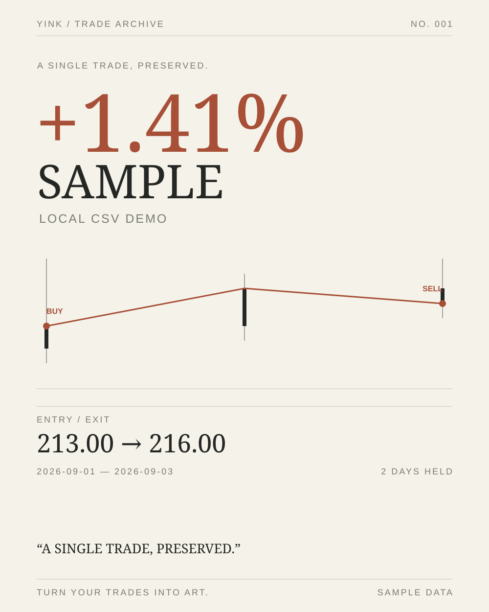

# 盈刻 · YINK

**Turn your trades into art.** 揽盘间跌宕，镌一迹风华。

盈刻是一个可从本地打开的交易艺术图片编辑器：选择股票和历史日期，可在 K 线上标记买入与卖出，也可直接使用未标点的原始 K 线；为价格轨迹选择风格，再把它作为独立贴图放入艺术画布。所有编辑、计算与 PNG 绘制均在浏览器内完成。



上图使用仓库自带的三条 CSV 示例数据制作，仅展示作品风格，不代表真实交易或在线行情。

## 开始使用

从仓库的 Releases 下载 `YINK-offline.zip`，解压后双击 `YINK/index.html`；也可以下载整个项目，直接双击根目录的 `index.html`。无需 Node、安装、账号、API Key、服务器或域名。

想立即体验，可切到“导入 CSV”并点击“一键试用示例数据”；它直接在本地加载三条虚构日 K，无需选择文件或联网。

1. 输入股票代码或名称，选择证券和日期，加载 K 线。当前搜索范围为 A 股、港股、美股。高级设置可手动选择分时 K（5 分钟）、小时 K、日 K、周 K，以及在线行情的前复权、后复权或不复权。分时和小时 K 可分别把区间起止时刻设到分钟，默认覆盖全天。自动模式在 2 天内优先 5 分钟 K、14 天内小时 K、180 天内日 K、更长区间周 K；使用全天范围时，数据读取失败或不足两根会逐级尝试较粗时间级别。手动缩窄到具体时刻时保持所选分钟或小时粒度。制作贴图至少需要两根 K 线；如仍不足，请扩大日期或时刻范围。
2. 加载至少两根 K 线后，可不标 BUY / SELL，直接点击“选择 K 线风格 · 制作原始贴图”。此时使用完整已加载区间，也可自定义截取；买卖标点、盈利强调和交易数据模块不可用。若要记录交易，可在 K 线上滚轮缩放、左右拖动，点击 K 线连续添加 BUY 和 SELL。交易节点表可逐笔修改真实成交价、数量或删除节点。只标记一买一卖且数量留空时，沿用投入金额计算；多笔交易须为每笔填写数量，页面按移动平均成本计算已实现盈亏，并用所选区间最后一根 K 线收盘价估算剩余持仓。填写数量时可在同一根 K 线上依次买卖；交互图和艺术贴图中的重叠标点会错开并以引线指向实际价格，交易段贴图也会带上一根相邻 K 线。只标了部分买卖点时须补全或删除节点后再进入风格步骤。
3. 点击“固定交易轨迹”，先在“标准样式”和“风格化 K 线”之间选择。标准样式可选择极简蜡烛、价格线或面积轨迹，以及涨跌色、贴图底色和标签；水墨风 1 按真实开高低收绘制，涨为白色蜡烛、跌为黑色蜡烛；收盘轨迹线采用本地 Squiggy 可变宽笔触，叠加浅墨晕染与断续飞白细丝，蜡烛周围也有半透明墨晕，贴图保持透明，可调笔触粗细、晕染强度、收盘轨迹线，并分别选择 BUY / SELL 的墨点、断墨圈、朱印框或笔锋箭头，也可上传图片标点。水墨风 2 则以真实收盘价绘制无蜡烛的苍劲折线，可调笔触粗细、飞白程度与浅墨副线；使用本地 Squiggy/Canvas 2D 透明笔刷渲染，避免 WebGL 合成带入白色底。大面积背景墨点可在艺术编辑器里作为单独图片图层添加。标准样式的高级设置可调整线条与蜡烛粗细、BUY / SELL 标点形状与颜色，或上传本地图片作标点；隐藏文字标签时仍保留标点。盈利轨迹可不强调、用虚线强调，或沿盈利区间标红。盈利区间按持仓期间收盘价是否高于当时平均成本判断。贴图截取可选择交易段、完整已加载区间，或自定义包含全部交易节点的日期范围。自定义截取时，未平仓持仓以截取末尾的收盘价估值。
4. 点击“生成 K 线贴图”进入艺术编辑器。画布预设可切换纵向和横向（4:5 / 5:4、9:16 / 16:9、A4 纵 / 横），方形 1:1 保持不变；也可输入自定义宽高比（例如 3:4、16:9，范围 1:4 到 4:1）。可修改背景、添加文字/形状/本地图片，也可从“预设贴图”一键加入云染、飞溅、流痕和泼墨背景，以及仅含图形标志的盈刻 Logo；泼墨背景自动放在 K 线下方。每张预设都是透明、可独立编辑的图片图层。还可把买卖价格与持仓时间等交易数据加入独立图层，并编辑图层位置、大小、旋转、颜色、透明度。背景和图片贴图可选择完整显示或铺满裁切，并在铺满时调整横向、纵向裁切位置。选中标准 K 线图层后仍可直接调整轨迹形式、颜色、标点、盈利强调及贴图背景；选中水墨 K 线图层后可调整笔触与买卖标点；水墨风 1 可调整晕染和收盘轨迹线，水墨风 2 可调整飞白程度和浅墨副线。经典 Gallery / Obsidian 模板可分别隐藏收益率、买卖价格、交易日期、投入金额、盈亏金额等数值。
5. 点击“保存 PNG”导出成品；点击“保存项目”下载包含图层和本地图片的 JSON。以后可在首页的“继续编辑已有作品”直接打开该文件。艺术编辑器自动保存浏览器草稿，可在“编辑偏好与导出”中关闭。

编辑器支持视图缩放、直接拖动图层、拖动任一角调整大小（旋转后沿图层方向缩放，并固定对角）、对齐到画布、图层排序、隐藏、锁定、复制、删除，以及撤销/重做。切换预设方向或自定义画布比例会保留各图层尺寸，并按新画布高度调整纵向位置；方向与自定义比例会保存在项目 JSON 中。视图缩放只影响编辑时的画布大小，PNG 仍按所选输出尺寸重新绘制；A4 横向在 2480 档导出为 3508 × 2480。交易数据模块包括买卖价格、持仓天数、投入金额和盈亏金额；数量模式即使没有填写投入金额，也可加入盈亏金额模块。文字图层可绑定交易数据，也可改为自由文字；即使重命名，绑定关系仍会保留。长标语会按文字框换行，可选择自动缩小字号适配文字框，或固定字号并裁切。重新固定交易时，所有 K 线贴图和已绑定的文字都会更新。背景图片和图片贴图均可选择铺满裁切或完整显示，贴图还可以原位替换。键盘支持方向键微调、`Delete` 删除、`Ctrl+Z` 撤销、`Ctrl+Y` 重做、`Ctrl+D` 复制。K 线风格步骤中的“快速成图 · Gallery / Obsidian（可选）”是直接导出经典模板的捷径，艺术编辑器是主流程。

文字图层内置十五款可离线使用的免费字体，新增 Zhi Mang Xing、Liu Jian Mao Cao 和 Long Cang 三款中文书写字体。字体库涵盖中文黑体、宋体、书法与标题字，以及现代无衬线、优雅衬线、窄体、手写、等宽和复古英文标题。字体按需从本地文件加载，无需联网；具体来源及 SIL OFL 授权文本见 `assets/fonts/README.md`。选中文字图层后可上传自己的 TTF、OTF、WOFF 或 WOFF2 字体（单文件最大 20 MB）；上传后会先检查浏览器能否解码，再用于预览和 PNG 导出。自定义字体数据会写入项目 JSON，因此重新打开仍可编辑；大字体可能超出浏览器草稿存储空间，此时请下载项目 JSON。请自行确认所上传字体的使用授权。

主页面右上角的“系统设置”可选择界面文字大小（小、中、大）、中文或英文，以及浅色或黑夜主题。默认中文、中号、浅色主题；设置保存在当前浏览器，刷新后继续使用。黑夜主题只调整操作界面和交互行情图的颜色，不改变海报画布、贴图或 PNG 内容。界面字号也不影响海报文字排版，作品字号由编辑器内的文字图层控制。语言切换会更新页面控件和操作提示，用户输入的股票名称、自由文字及作品内容不会被改写。

同一股票或相同的原始 CSV 数据重新生成同一类贴图时会保留当前排版，包括切换 CSV 时间级别后重新载入。原始 K 线与带交易标点的作品采用不同的起始布局，二者互相切换，或换成其他股票及不同 CSV 数据时，会创建新画布。旧画布在本次编辑中仍可通过撤销找回；长期保留请先保存项目 JSON。

数据源不可用时可切换到 CSV。示例文件为 [`examples/sample.csv`](../examples/sample.csv)，内容仅供演示，不代表真实行情。CSV 至少需要以下表头：

```csv
date,open,high,low,close,volume
2026-09-01,210,215,208,213,1000000
2026-09-02,213,220,211,218,1200000
```

CSV 支持 UTF-8、BOM 与常见引号格式，日期可使用 `YYYY-MM-DD`，分时及小时 K 使用 `YYYY-MM-DD HH:mm`；单个文件不要混用两种格式。5 分钟 CSV 至少要有一对同日连续 5 分钟记录，且时分须落在 5 分钟刻度上；可按自然小时聚合成小时 K，也可聚合成日 K 或周 K。小时 CSV 可聚合成日 K 或周 K，日 CSV 可聚合成周 K；无法从粗粒度 CSV 还原更细 K 线。CSV 价格由文件提供，浏览器不会计算前复权或后复权。导入时可选择 USD、CNY 或 HKD 作为金额单位。文件只在浏览器中读取，不会上传。浏览器存储空间允许时会一并保存原始 CSV 数据，刷新后仍可切换时间级别；容量不足时保留当前 K 线和交易状态，页面会提示重新导入原文件。

## 数据与架构

手机端输入控件保持至少 16px，避免 iPhone 输入时自动放大，同时保留双指缩放。手机艺术编辑器提供“画布／添加／图层”入口：默认轻点选中模块、上下滑动浏览；开启“拖动模块”后可移动和缩放，关闭后恢复滚动。新增模块后自动打开属性。手机首页橙点沿轨迹随滚动移动，全页浅橙背景光随页面滚动，内容逐段出现并提供按钮按压反馈；系统开启“减少动态效果”时停用这些运动。

- `EastmoneyDataSource` 与 `CSVDataSource` 均返回按时间升序的 `{ date, open, high, low, close, volume }[]`；5 分钟与小时 K 的 `date` 含时分。
- 在线搜索及 5 分钟／小时／日／周 K 通过东方财富公开接口的 JSONP `<script>` 请求完成，以适配 `file://` 页面。搜索主接口无结果或不可用时，会尝试备用搜索接口；输入完整 A 股、港股或美股代码时，还会并行探测对应市场的日 K。在线 K 线可请求不复权、前复权或后复权价格。分钟级历史行情可能只覆盖近期；公开接口可能改版、限流或受到浏览器策略影响，各时间级别及复权路径仍需在真实联网浏览器验证。
- `trade.js` 以事件数组保存多笔 BUY / SELL。单组无数量节点保留旧版收益计算；填写数量后按移动平均成本结算部分卖出，分别给出已实现盈亏、剩余持仓估值与总盈亏。数量模式的收益率在填写参考资金时以该金额为分母，否则以累计买入成本为分母。
- `editor/model.js` 保存画布、背景、图层和按贴图截取设置固定的 K 线快照；`editor/render.js` 在任意输出尺寸重绘作品。K 线贴图以矢量指令重新绘制，放大导出不会使用网页截图。
- `poster.js` 保留 Gallery / Obsidian 快速模板。数量模式没有填写参考资金时，模板只展示有依据的盈亏金额，不把空资金显示为零。最近使用股票、交易状态与编辑器草稿保存在 `localStorage`；浏览器禁用本地存储或数据超出配额时，可下载项目 JSON。

单组无数量节点的收益率按 `(卖出价 - 买入价) / 买入价 × 100%` 计算。数量模式先求已实现盈亏与剩余持仓按所选区间末收盘价的未实现盈亏，再以参考资金（已填写时）或累计买入成本（未填写时）为分母计算收益率。填写参考资金时，系统会检查它是否覆盖交易序列中的最高净资金占用。当前不计手续费、税费、汇率或分红；跨市场复权口径以行情接口返回数据为准。

## 验证与限制

开发者可运行 `node tests/data.test.js`、`node tests/core.test.js`、`node tests/editor.test.js`、`node tests/ui-flow.test.js`、`node tests/i18n.test.js` 与 `node tests/package.test.js`，终端用户不需要 Node。测试覆盖日期与分时数据解析、精确到分钟的起止筛选、CSV 分时到小时／日／周聚合、四种在线 K 线参数、单组及多笔数量收益、分钟级持仓时间、编辑器模型与图层渲染、标点图片与盈利强调、项目 JSON 重新打开、草稿恢复、撤销与重做、界面中英文切换、字号与主题设置，以及从 CSV 导入到艺术图片导出的交互流程。打包检查确认页面引用的脚本、样式及其资源都位于项目内。

更新源码后，开发者可在 Windows PowerShell 运行 `tools/build-offline.ps1` 重新生成离线包；脚本会逐项校验压缩包与源文件的 SHA-256。发布前还应从压缩包解压，并对解压目录运行 `node tests/package.test.js <解压后的 YINK 目录>`。

在普通浏览器中验收本地流程：双击 `index.html`，导入 `examples/sample.csv`，把 2026-09-01 设为 BUY（213），2026-09-03 设为 SELL（216），投入 10000。应显示约 **+1.41%**、**2 天**、盈亏 **+140.85**、最终金额 **10140.85**。随后进入艺术编辑器，导出 PNG，再保存项目 JSON；刷新页面或清空草稿后，可从首页重新打开该项目。选择 A4 与 2480 px 导出宽度时，PNG 应为 **2480 × 3508**。在线行情可使用页面内的“三市场自检”核对 600519、00700 和 AAPL。

页面内的“验证三地行情接口”会依次搜索 `600519`、`00700`、`AAPL`，并读取 2025 年 9 月日 K。2026-10-04 在本地预览浏览器运行该检查，三地均返回有效日 K（3 / 3 通过）；AAPL 搜索、周 K 和近期 5 分钟 K 也已实际加载。公开接口的数据覆盖范围和可用性可能变化，遇到网络或接口故障时可切换 CSV。离线包已解压并通过资源完整性检查；受控浏览器的安全策略不允许直接打开 `file://` 页面，双击打开的交互行为仍需在普通浏览器验收。
